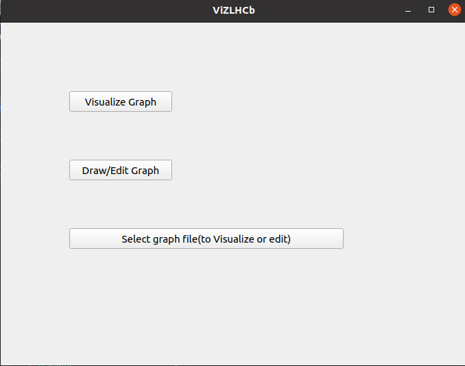
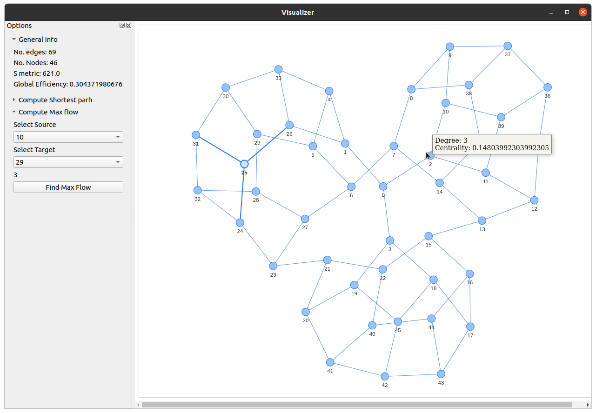
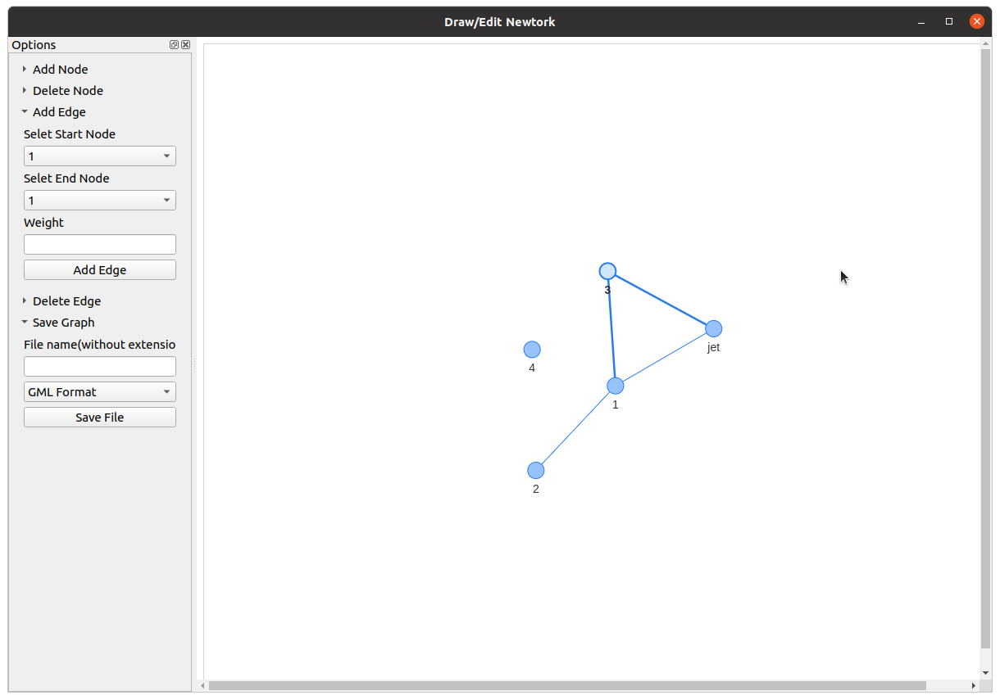

# VizLHCb


## How to use
Checkout git
```
git clone https://github.com/nahimilega/VizLHCb.git
cd VizLHCb
```
Run the app

```
pip install -r requirements.txt
python main.py
```

## ScreenShot
 </br>
 </br>

## Decisions
### Choosing NetworkX library
"A man is only as good as his tools"     - Emmert Wolf
1) NetworkX is widely used and very well intergrated with pyvis for providing interactive visualization
2) Graph tool, another library, has a faster implementation of algorithms; however, for the purpose of this application, at this small scale, it didn't have any significant edge.
3) NetworkX provides lot more features.
4) NetworkX has Good Documentation, Wide community and well maintained.

### Choosing data structure for storing graph 
The data structure that I considered included set, heaps, queue, hashtable, tree, trias, list of pointers, adjacency list, adjacency matrix etc
For this problem, we would be using software to design, simulate and test the network for potential problems. Hence would be **heavily using graph iterating algorithms** like BFS, DFS or flow management algorithm. Hence, adjacency list or adjacency matrix would be more suitable for the task.
Moreover, the graph would be **sparsely populated**, as each node in L1, L2 and L3 layers of LHCb would be only connected to a handful of nodes from another layer.  </br>
Therefore **adjacency list would be the most logical choice** for storing the data as it would provide maximum performance with relatively low storage space.
</br>
</br>
Furthermore, to have a standardized process and facilitate **interoperability** with other graphing, visualizing software and graph databases. **The application provides feature to import/export graphs in GML(Graph Manipulation language) and YAML formats as well.**


### How you solved the issue of visualization.
Here are the steps I followed to solve this problem
1) Start with understanding the problem statement and LHCb network architecture. Solving question one links provided helped in developing an understanding of the problem
2) Explore the tools and technology that I would need for the task. Here I discovered networkX, pyvis, graph-tool and other existing tools and similar ideas.
3) Based on research done and the problem statement, I decided on the libraries I an going to use(networkX, pyvis) and made a basic design of the software structure based on the objective of the problem and OOPs concepts
4) Made a preliminary graph class to get comfortable with the tools as well as to make a backend of the application
5) Expand the functionality and made a basic GUI.
6) Further expanded the features, added additional features.
7) Did error handling, testing and documenting.


## Assumptions 
* Network is a undirected graph. I assumed keeping in thought that jets, sensor and other detectors are completely controled by this network, and hence there would be a need to send switch on/switch off signal. Hence bidirectional data transfer.
* There could be a connuctions between componens of same level for load balanacing purposes, hence can't be modeled as tree.
* Edges are weighted, where weight represent the traffic it can handle. 
* Program generates temporary HTML files
* User is smart(Because error handling is not that great xD)

## Problems we witness at the scale of LHCb
1) For LHCb, the system would be having millions of nodes, hence it would need a sophisticated implementation of algorithms with the focus on increasing performance. 
2) Designing a GUI for visualizing millions of nodes in an effective and user-friendly manner would be a primary task


# Question 1
The LHCb Online Tem to which you are currently applying has been designing for over 7 years a state-of-the art-cost-optimized data acquisition cluster. This system, when commissioned, will allegedly be the largest data acquisition machine in theWorld. The currently designed LHCb data acquisition must losslessly handle a constant flow of 32 Terabits of data and must perform a cluster-wide transposition in real-time.
This is because the data are scattered all over the LHCb detector and to analyze them, we must first assemble all the fragments from all the servers acquiring data."
Shortly describe in your own words (max 4 bullet points, each max 3 sentences) what in your opinion are the major NETWORK ENGINEERING challenges in this situation"
You may freely use any help on the web. I would suggest having a look at the project description first, including the PROVIDED LINKS


To evaluate the challenges, we would consider this problem with a spectrum of **Cost, Scalability, Reliability, Use case, Security and Maintenance.**

* Because data is received from event jets in real-time, protocol ensuring lossless transmission like **TCP cannot be used**. So the challenge is to ensure a lossless data transmission without packet drop. For that, we need to **identify bottlenecks and avoid network congestion** to avoid the queue being full at the node and eventually losing precious physics data. A topology with **even data flow distribution** is needed.

* Running the collider is an expensive task, and the data achieved is too precious. Therefore **backup networks are needed to avoid last-minute failure** leading to congestion at other parts of the network and increase reliability. 

* As the "interesting" events are singled out and stored, this adds on to the **datastream's busty nature**. Hence a **load balancing mechanism** would be needed to reduce sudden network congestion. Also, network topology should **not be too complex** and should maximise the use of **off the shelf components** to make the job of **maintenance easy**.
 
* The network **needs to be completely distributed** as the sheer amount of data rate is huge to communicate information back and forth central system. Also, the central model would be costly and limit the scalability in terms of the future expansion of data sensors. Similarly, keeping the the **disk buffer between L1 L2 and L3 triggers minimal** to reduce cost and make it scalable.

As it is a internal network security is not an issue here :)


## Ref
https://stackoverflow.com/questions/52615115/how-to-create-collapsible-box-in-pyqt
https://stackoverflow.com/questions/51154871/python-3-7-0-no-module-named-pyqt5-qtwebenginewidgets
https://www.tutorialspoint.com/
https://networkx.org/documentation/stable/index.html
https://pyvis.readthedocs.io/en/latest/index.html
https://graph-tool.skewed.de/